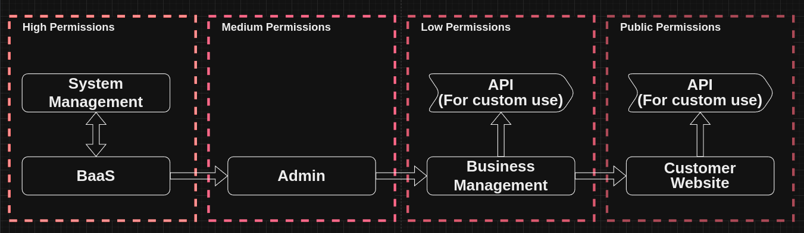
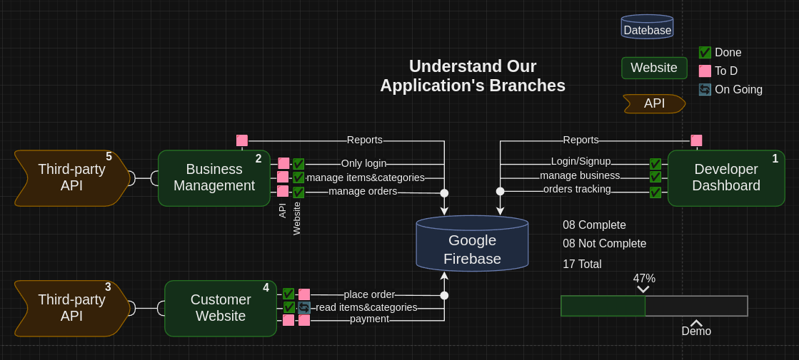

# OrderSync 📦️🔗


**THE PROJECT ARE NOT COMPLETED (UNDER DEVELOPMENT) (LOGICAL PHASE)**

## 🔶 Table of Contents
- [Diagrams](#🔶-diagrams)
- [Description](#🔶-description)
- [To Do List](#🔶-to-do-list)
- [Technologies](#🔶-technologies)
- [Features](#🔶-features)
- [Installation](#🔶-installation)
- [Usage](#🔶-usage)
- [Contributing](#🔶-contributing)
- [Project Versions](#🔶-project-versions)
- [License](#🔶-license)

## 🔶 Diagrams
**Permission Levels and InterProcess Communication (IPS)**



## 🔶 Description
OrderSync is a cutting-edge ordering system meticulously crafted for developers and business owner. Seamlessly integrating into applications, it boasts a robust backend powered by Google Firebase ensuring secure authentication. With a blend of Google MatrialUI and JavaScript, coupled with the dynamic capailities of ReactJS, OrderSync delivers a streamlined and efficient online ordering experience. Simplify your development journey with OrderSync, where technology meets intuitive order management.

## 🔶 To Do List
### Project
- Tasks 🎯
	- To Do
		- [ ] Split up create new user for business manager.
		- [ ] Seprate update business form in different pages for better user experience.
		- [ ] Seprate add new business form in different pages for better user experience.
		- [ ] Add, loading screen.
		- [ ] Tables sorting.
		- [ ] Caching data instead of API request.
		- [ ] Create, User profile page.
		- [ ] Create, Home page (Overview).
		- [ ] Create, Performance page.
		- [ ] Create, businesses sales widget.
	- In Progress
	- Done
		- [x] Optimize, 'addNewBusiness' form to use it in 'businessSetting' page.
		- [x] Enhance, signupUser/loginUser/logout/openApp functions to record user signup/login/logout/openapp process
		- [x] Change, add business form to "Formik" forms with "MatrialUI" and "yup" validation schema.
		- [x] Change, businesses management Table component to MatrialUI table.
		- [x] Change, the login/signup forms to "Formik" forms with "MatrialUI" and "yup" validation schema.
		- [x] Create, Manage business tab.
		- [x] Create, Pending orders tab.
		- [x] Create, Orders list tab.
		- [x] Start using MatrialUI.
		- [x] Create, orders, customers collections Firestore.
		- [x] Add. user subcollection to redux state on login.
		- [x] Collect admin signup data to firestore collection.
		<br>[...](references/old-todos.md)
- Feature Development 🚀
	- To Do
	- In Progress
	- Done
- Bug Fixes 🐞
 	- To Do
 		- [ ] Fix, MatrialUI fields didint take any effect when i reinitilize the field value.
 		- [ ] Fix, reinitilize values is not visible with selectbox and checkbox fields in update business page.
 		- [ ] Fix, Warning: validateDOMNesting(...): < table > cannot appear as a descendant of < p >, in business management page.
 		- [ ] Fix, Warning A uncontrolled input in update business page
	 	- [ ] Fix, getDocs.js requests built on how many subcollection i have and react duble it more.
	- In Progress
	- Done
		- [x] Fix, 'businessSettings' navigation
		- [x] Fix, login/signup forms trigger all errors in same time if the user enter a wrong one field.
		- [x] Fix, The app are not loading correctly when the user open the app again after login
- Brainstorming 🌪️
	- [ ] Admin businesses limit avoid spamming.
	- [ ] Add, Custom google maps zone select for delivery zones.
	- [ ] Create, A basic documentation for the project.
	- [ ] Add, method to make backup for all database (system owner).
  	- [ ] Add, method for admin to extract business data to Exel or google sheet file.

## 🔶 Technologies

* CSS
* JavaScript
* ReactJS
* MatrialUI
* Firebase

## 🔶 Features
- 

## 🔶 Installation

1. Install npm and.
```bash
npm install -g npm
```

2. Clone this repository.
`https://github.com/AhmedNasser1010/pos-system-admin.git`

3. Run `npm i` in the project directory.
```
cd pos-system-admin
npm i
```

4. Run `npm run dev` to start the app.

The app will be accessible at http://localhost:5173.

## 🔶 Usage
Welcome to our developer-friendly web application, a powerhouse ordering systems. Here's your guide to leveraging the potential of our platform:

1.  **Admin Sign-up:**
    
    -   Kickstart your development journey by signing up as an admin to gain access to a robust set of tools.
2.  **Business Management:**
    
    -   Easily integrate and manage multiple businesses, spanning retail, coffee shops, restaurants, and online ordering, all with developer-centric controls.
3.  **API Extraction:**
    
    -   Extract business-specific APIs, including the Menu API for fetching product details, the Orders API for efficient order management, and the Payment API for secure transactions.
4.  **Integration Possibilities:**
    -   Seamlessly integrate extracted APIs into your own e-commerce website or custom orders manager, empowering you to tailor solutions for your clients.

Unlock the potential of our platform to streamline and enhance your development workflow. Elevate your projects with versatile APIs designed for efficiency, flexibility, and seamless integration

## 🔶 Contributing
Thank you for considering contributing to our project! We welcome contributions from the developer community to enhance the functionality and features of our web application.

1. Fork the repository.
2. Create a new branch: `git checkout -b my-feature`
3. Make your changes and commit them: `git commit -am 'Add some feature'`
4. Push to the branch: `git push origin my-feature`
5. Open a pull request.

Please adhere to the coding conventions and standards followed in the project.

**Finally, Thank you for your valuable contribution to making our web application even better.**

## 🔶 Project Versions
-

## 🔶 License

This project is licensed under the [Apache-2.0 license](LICENSE).
