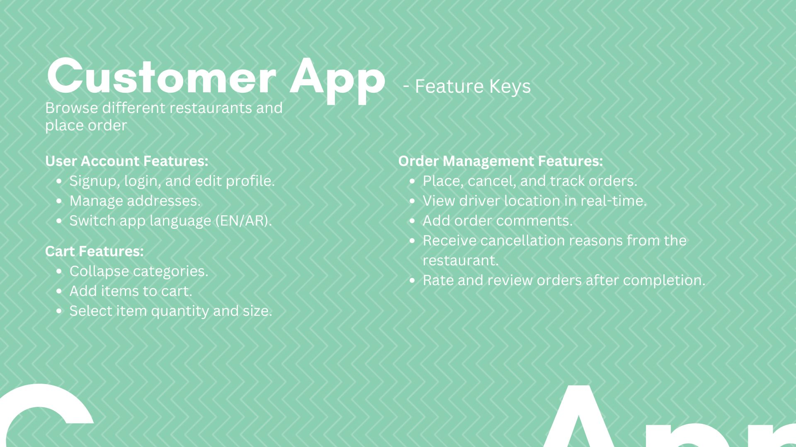
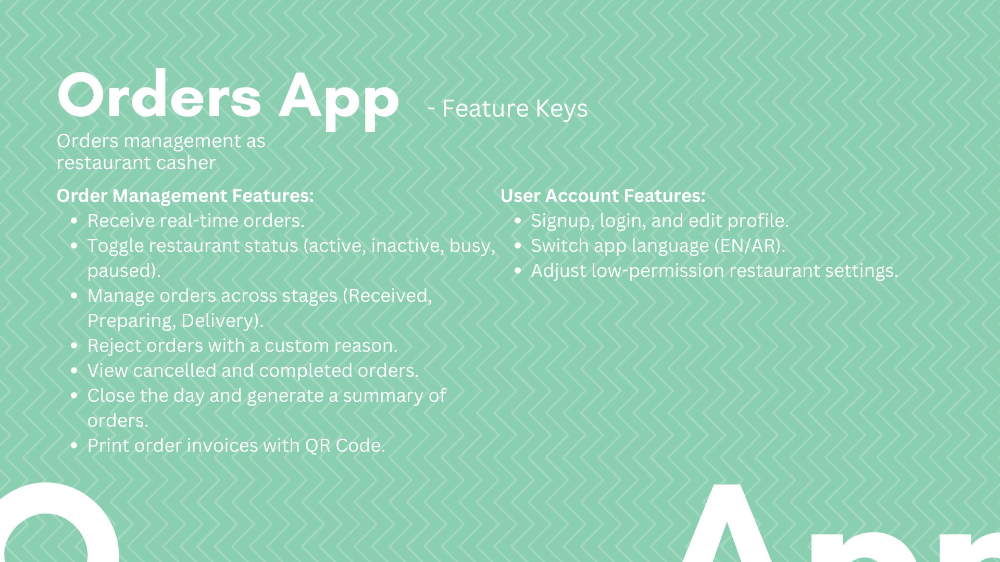
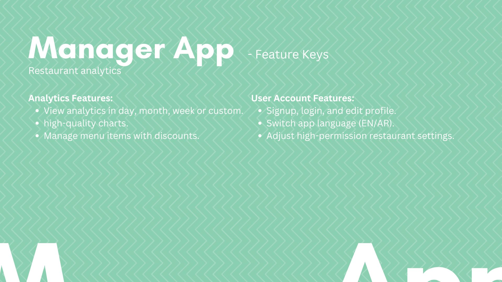
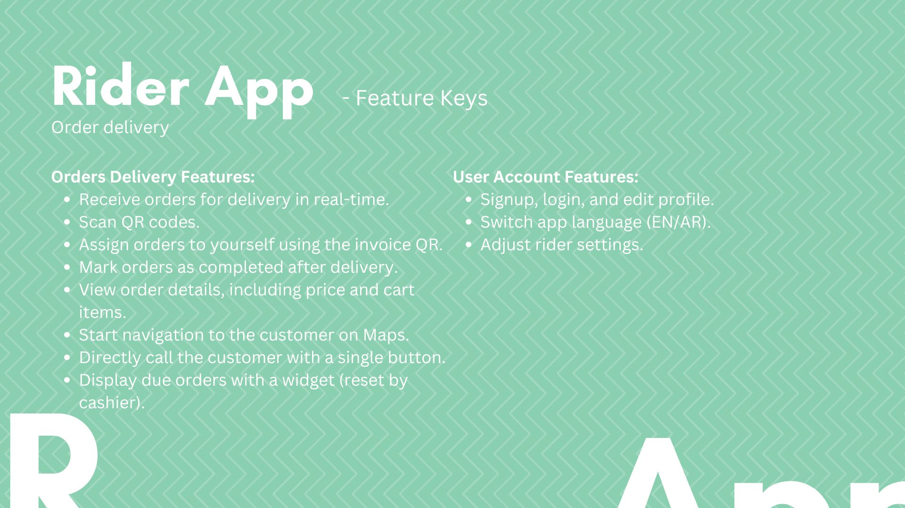

# Order Sync

## Table of Contents
1. [Demo Online Links](#demo-online-links)
2. [Introduction](#introduction)
3. [Applications](#applications)
6. [Technical Requirements](#technical-requirements)
8. [Future Updates and Maintenance](#future-updates-and-maintenance)
9. [Frequently Asked Questions (FAQs)](#frequently-asked-questions-faqs)

## Demo Online Links
Store Website: https://ordersync.vercel.app 
Orders Website: https://ordersync-orders.vercel.app 
Rider Website: https://ordersync-rider.vercel.app 
Partner Website:  

## Introduction

### Brief Overview of the App
Order Sync is a cutting-edge ordering system meticulously crafted for restaurants. Seamlessly integrating into applications, it boasts a robust back-end powered by Google Firebase, ensuring secure authentication. The Order Sync app delivers a streamlined and efficient online ordering experience.

## Applications

## Technical Requirements

| App              | Devices           | Provided On  |
|------------------|-------------------|--------------|
| Customer App     | Any               | PWA/Website  |
| Orders App       | Smartphone/Tablet | App/Website  |
| Manager App      | Smartphone/Tablet | App/Website  |

## Future Updates and Maintenance

**Upcoming Updates**
- Manager app split to orders_app and manager_app (orders_app Completed)
- Enhanced reporting features

## Frequently Asked Questions (FAQs)

  
Why use Order Sync as a business owner?

  1. **Increased Customer Base Network Effect:**
    - The Customer Shop app features multiple restaurants in the same city, increasing visibility and potential customer base.

  3. **Comprehensive Reporting:**
    - Access detailed reports on sales, order trends, and customer preferences for informed decision-making.

## Project Versions

 - 0.1.0 Demo

## License

This project is licensed under the [Apache-2.0 license](LICENSE).
