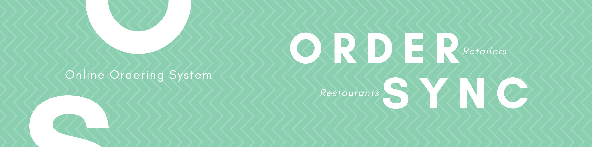
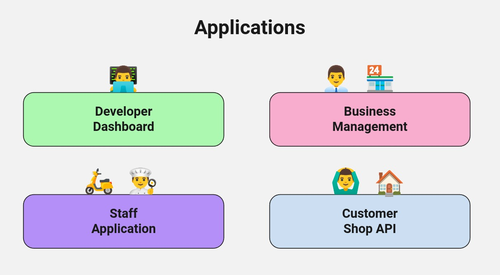
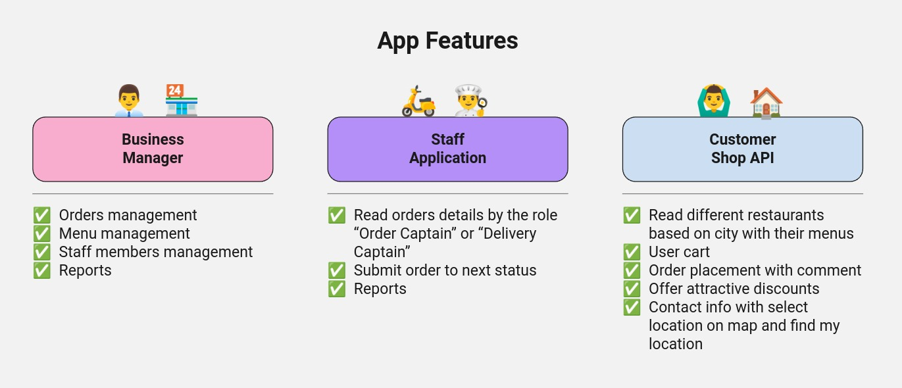
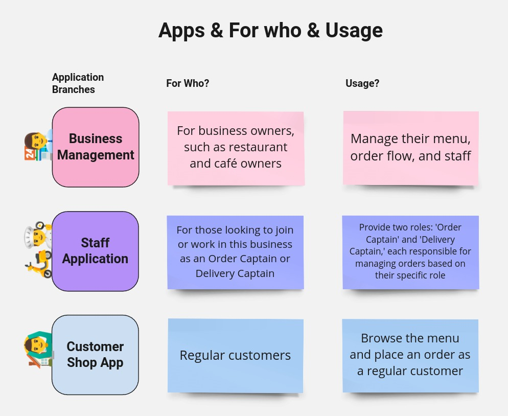
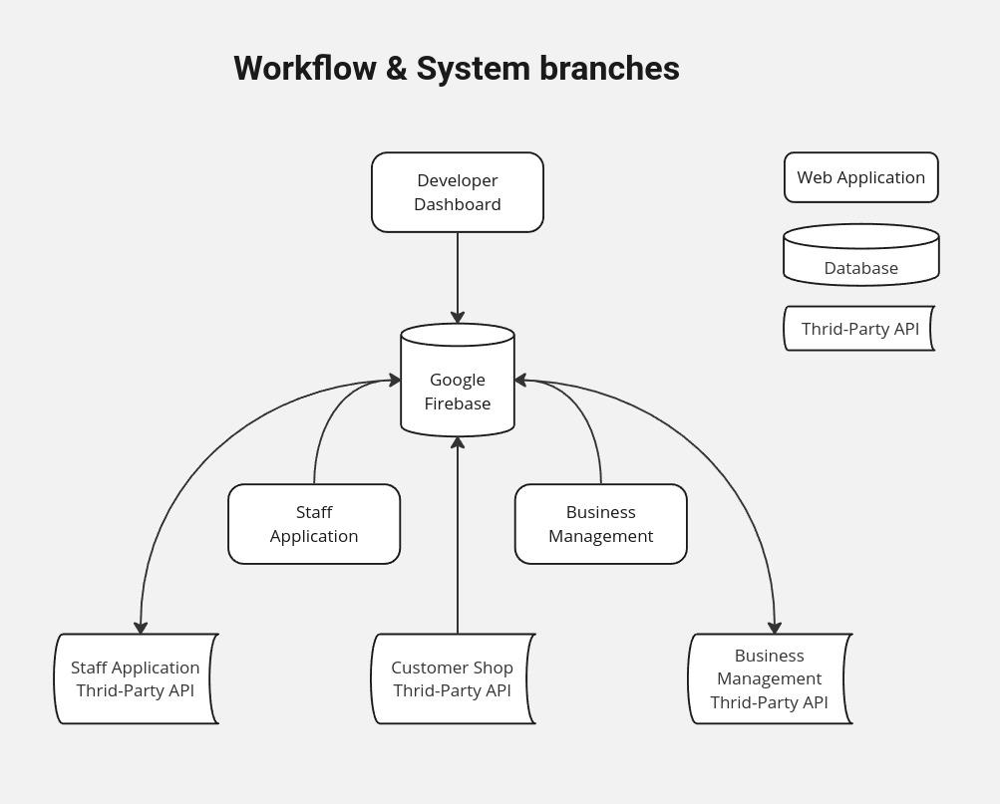
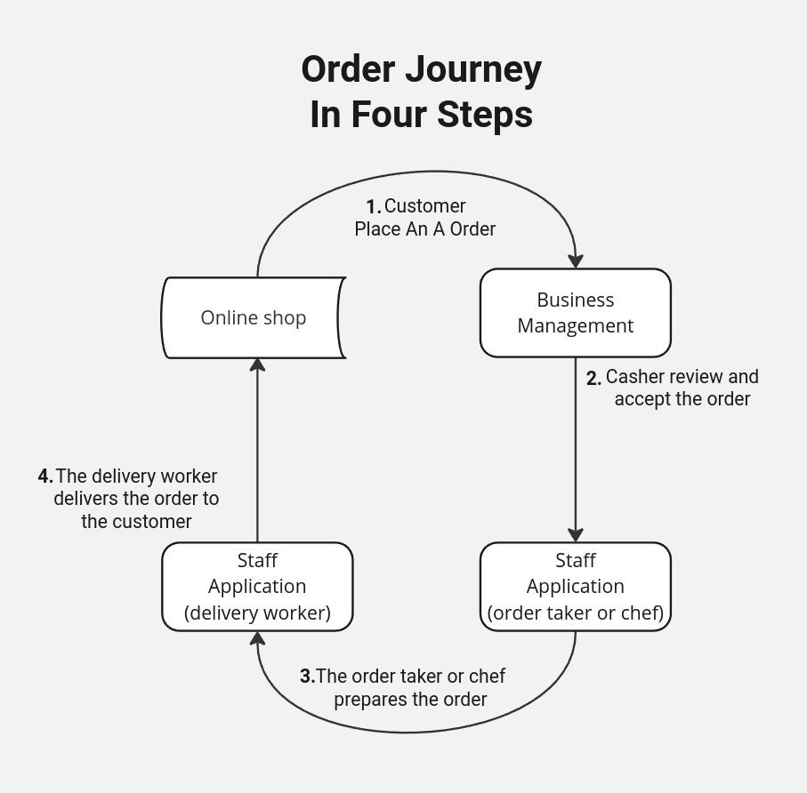

# OrderSync 🛵🔗

[**Demo Version Ready To Use**](demo-test.md)

## 🔶 Table of Contents
- [Diagrams](#🔶-diagrams)
- [Description](#🔶-description)
- [Technologies](#🔶-technologies)
- [Applications](#🔶-Applications)
- [Contributing](#🔶-contributing)
- [Project Versions](#🔶-project-versions)
- [License](#🔶-license)

## 🔶 Diagrams

## 🔶 Description
OrderSync is a cutting-edge ordering system meticulously crafted for developers and business owner. Seamlessly integrating into applications, it boasts a robust backend powered by Google Firebase ensuring secure authentication. With a blend of Google MatrialUI and JavaScript, coupled with the dynamic capailities of ReactJS, OrderSync delivers a streamlined and efficient online ordering experience. Simplify your development journey with OrderSync, where technology meets intuitive order management.

## 🔶 Technologies

* JavaScript
* ReactJS
* MatrialUI
* Firebase

## 🔶 Applications

- [Business Creator](businesses_creator/)
- [Business Manager](businesses_manager/)
- [Staff Application](staff_app/)
- [Customer Online Shop Template App](customer_online_shop_template/)

**Provided APIs:**
- Business Manager API. **Still BackStage**
- Staff Application API. **Still BackStage**
- [Customer Shop Third-Party API](user_gateway/)

## 🔶 Contributing
Thank you for considering contributing to our project! We welcome contributions from the developer community to enhance the functionality and features of our web application.

1. Fork the repository.
2. Create a new branch: `git checkout -b my-feature`
3. Make your changes and commit them: `git commit -am 'Add some feature'`
4. Push to the branch: `git push origin my-feature`
5. Open a pull request.

Please adhere to the coding conventions and standards followed in the project.

**Finally, Thank you for your valuable contribution to making our web application even better.**

## 🔶 Project Versions

- **0.1.0 Demo version is coming soon! stay tuned**

## 🔶 License

This project is licensed under the [Apache-2.0 license](LICENSE).
