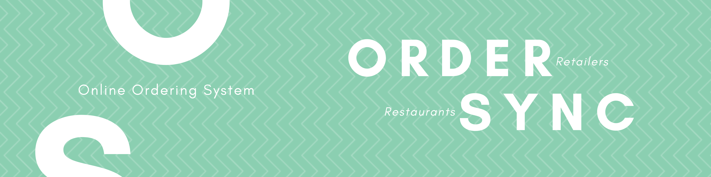
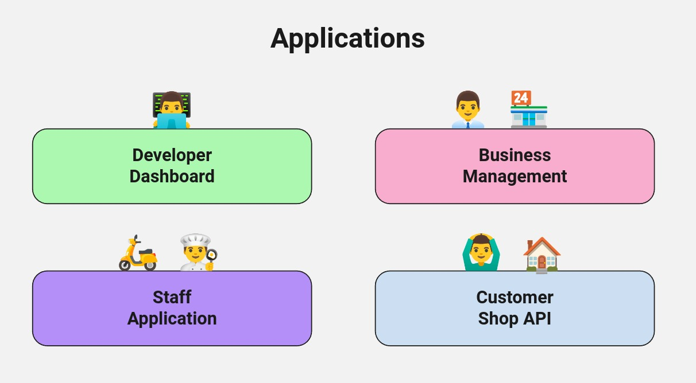
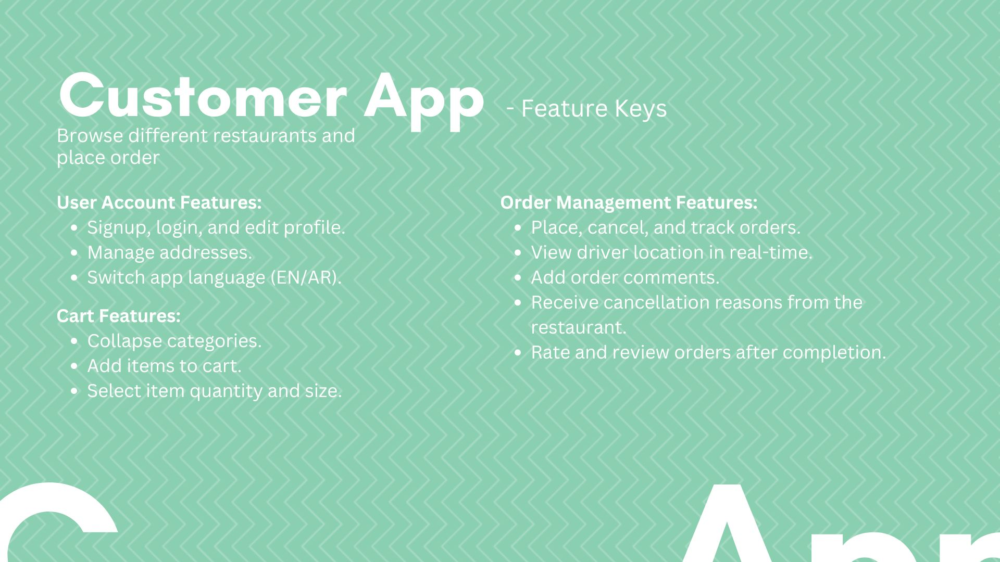
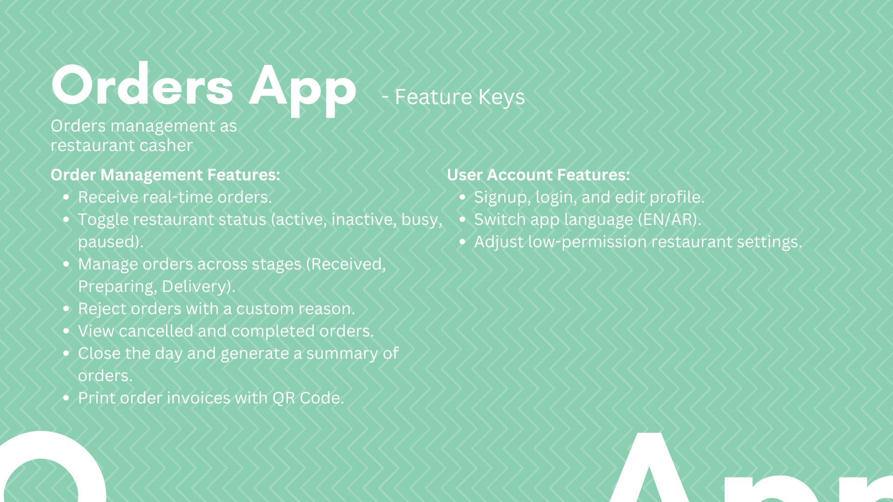
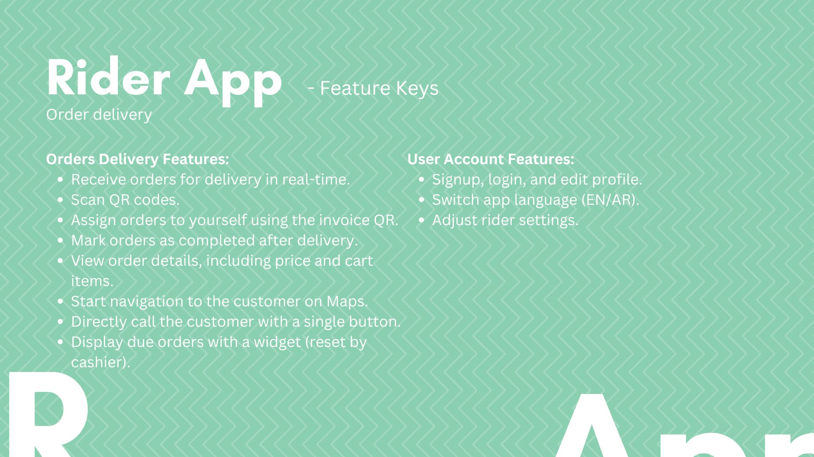
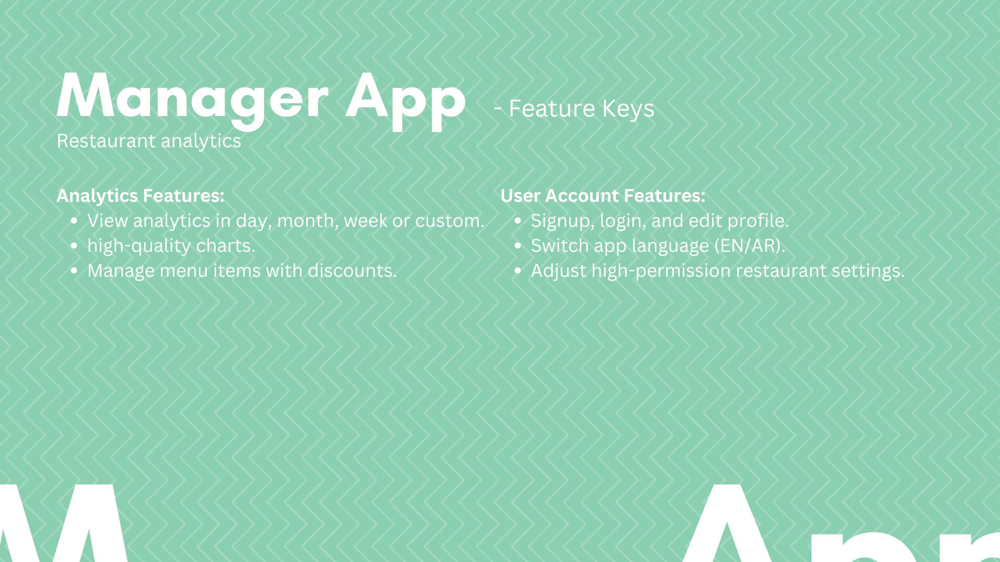

# Order Sync

A complete, multi-app **online food ordering platform** built for restaurants. Order Sync connects customers, restaurants, delivery drivers, managers, and platform partners through five purpose-built web applications that share a single real-time Firebase backend.

## Table of Contents

1. [Overview](#overview)
2. [The Five Applications](#the-five-applications)
   - [Customer App](#customer-app--zajil)
   - [Onboarding App (Partner Admin)](#onboarding-app--partner-admin)
   - [Orders App (Kitchen)](#orders-app--kitchen)
   - [Driver App](#driver-app)
   - [Manager App](#manager-app)
3. [Shared Infrastructure](#shared-infrastructure)
4. [Architecture](#architecture)
5. [Getting Started](#getting-started)
6. [Running the Whole Platform](#running-the-whole-platform)
7. [Data & Firestore](#data--firestore)
8. [Documentation](#documentation)
9. [License](#license)

---

## Overview

Order Sync is a real-time ordering ecosystem with a **Firebase + Firestore** backend and five Next.js apps:

- **Customer App** — browse restaurants, order food, track deliveries live.
- **Onboarding App** — partners onboard restaurants, build menus & discounts, manage users and the fleet.
- **Orders App** — the kitchen's real-time order board.
- **Driver App** — delivery drivers claim orders and follow optimized routes.
- **Manager App** — analytics and business health dashboards.

Every app subscribes to the same Firestore data, so the moment a customer places an order, the kitchen sees it, a driver can claim it, the customer tracks it, and the manager's dashboards update — all in real time with no backend code to deploy.



## The Five Applications

### 🛍️ Customer App — *Zajil*

**Directory:** [`customer_app/`](customer_app/) · **Port 3004** · [README →](customer_app/README.md)

The public-facing food delivery PWA for customers.

**Key features:**
- Restaurant discovery — hero banner, search, cuisine filters, curated carousels ("Offers", "Top rated", "New", "Fast delivery").
- Full restaurant menus — category sections, item images, sizes, availability, item-level discounts, quantity steppers.
- 3-step guarded checkout — map-based location picker, validated contact info, payment (cash / online) with tips and promo codes.
- Live order tracking — real-time status timeline, live driver position on a map, and client-side **ETA**.
- Post-delivery ratings and feedback.
- Guest browsing with Google sign-in, English/Arabic, dark/light mode, installable **PWA** with offline support.



---

### 🏗️ Onboarding App — *Partner Admin*

**Directory:** [`onboarding_app/`](onboarding_app/) · **Port 3000** · [README →](onboarding_app/README.md)

The partner/admin control plane where the platform is configured.

**Key features:**
- Full **restaurant management** — create/edit businesses with info, address (map picker), owner, contacts, cuisines, opening hours, cook time, and live preview.
- **Menu builder** — categories, items, sizes, prices, and hide/show toggles.
- **Rich discount engine** — item & order-level discounts, expiration dates, AND/OR conditions, time-based rules, stacking modes, customer segments, usage limits.
- **User management** — drivers (with activation/approval), customers, and managers tables with add/edit/delete/hide and **Excel export**.
- **Live fleet map** — real-time markers for drivers, customers, restaurants, and orders.
- **Review moderation** — filter and hide reviews.
- **Received orders** view with export.
- **Platform settings** — global delivery fee per km and minimum fee.

---

### 🍳 Orders App — *Kitchen / Restaurant*

**Directory:** [`orders_app/`](orders_app/) · **Port 3002** · [README →](orders_app/README.md)

The real-time order board restaurant staff keep open on a tablet or phone.

**Key features:**
- Tabbed pipeline — Received / Preparing / Delivery / Completed / Voided with one-tap status actions and **batch accept & prepare all**.
- **Urgent order alerting** — escalating warning/critical thresholds with sounds, toasts, pulsing cards, and tab-title badges.
- Order details with customer info and **printable invoices**.
- Restaurant availability — working hours, "Open Now", and Active/Busy/Paused/Inactive status that the customer app respects.
- **Close Day** workflow, order workflow options (skip acceptance, auto-print invoice), display settings, and bilingual UI.
- Search across order number, customer, item, or status.



---

### 🛵 Driver App

**Directory:** [`driver_app/`](driver_app/) · **Port 3003** · [README →](driver_app/README.md)

The delivery driver console used on the road.

**Key features:**
- **Marketplace** of available (`READY`) orders with live new-order alerts and push notifications.
- **Recommended Orders** — automatic batch suggestions (same restaurant, nearby deliveries) with route distance, savings, and one-tap **Claim All**.
- Full delivery lifecycle — claim → start delivery → start route → complete, plus return-to-ready and call customer.
- Interactive **map** — active/available orders, restaurants, driver position, search, route rendering, and deep-link navigation.
- **Online/offline GPS tracking** streamed to Firestore (powers customer-side live tracking).
- **Cash balance limits** that block claiming when a threshold is reached.
- Manager-approval onboarding flow for new driver accounts.



---

### 📊 Manager App

**Directory:** [`manager_app/`](manager_app/) · **Port 3001** · [README →](manager_app/README.md)

The analytics and business health dashboard for restaurant managers.

**Key features:**
- **Today view** — real-time KPIs, paid/unpaid balance, active orders, status breakdown, top items, customer insights.
- **Analytics dashboard** — date ranges from last 3 hours to all time / custom, with KPI cards and percentage growth vs. the previous period.
- Charts for **sales trends**, **top selling items**, **category performance**, and **payment methods**.
- **Customer analytics**, **top delivery areas**, and **operations performance** (prep/delivery time, completion rate vs. benchmarks).
- **AI Insights** and a composite **Business Health Score** with strengths, improvement areas, and trends.
- Role-gated access with clear handling for unassigned users.



---

## Shared Infrastructure

| Component | Purpose | Location |
|---|---|---|
| **`packages/order-utils`** | Shared order state machine (transitions/guards), business-day logic, and the **discount engine** (conditions, segments, time rules, stacking, promo validation). | [`packages/order-utils/`](packages/order-utils/) |
| **`packages/types`** | Shared TypeScript types for orders, businesses, menus, customers, drivers, users, reviews, banners, services. | [`packages/types/`](packages/types/) |
| **`firestore.rules`** | Security rules protecting every collection. | [`firestore.rules`](firestore.rules) |
| **`firestore.indexes.json`** | Composite indexes for the queries the apps run. | [`firestore.indexes.json`](firestore.indexes.json) |
| **`firebase.json` / `.firebaserc`** | Emulator config (Auth :9099, Firestore :8080) and default project. | repo root |
| **`firebase-data-clone/`** | Scripts to export production Firestore + Auth data and import it into the local emulator. | [`firebase-data-clone/README.md`](firebase-data-clone/README.md) |
| **`docs/`** | Deep-dive docs on discounts, ETA/tracking, alerting, and known issues. | [`docs/`](docs/) |

## Architecture

```
                    ┌───────────────────────────────┐
                    │       Google Firebase         │
                    │  Auth · Firestore · FCM       │
                    └───────┬───────────┬───────────┘
                            │           │  real-time onSnapshot
        ┌───────────────────┴───────────┴───────────────┐
        │                                               │
 ┌──────┴──────┐  ┌───────────┐  ┌───────────┐  ┌──────┴──────┐
 │ Customer App│  │ Orders App │  │ Driver App│  │ Manager App │
 │  (order)    │  │ (kitchen)  │  │ (deliver) │  │ (analyze)   │
 └─────────────┘  └───────────┘  └───────────┘  └─────────────┘
                          ┌───────────┐
                          │Onboarding │
                          │  App      │
                          │(configure)│
                          └───────────┘
```

A customer order flows through the shared state machine — **Received → Accepted → Preparing → Ready → Reserved → Picked Up → On Route → Delivered** — as the kitchen, driver, and customer apps all react to the same Firestore documents.

## Getting Started

This is an npm-workspaces monorepo.

### Prerequisites
- Node.js ≥ 20
- A Firebase project (web + Admin SDK credentials)
- Optional: Firebase Emulator Suite for local development

### Install

```bash
npm install
```

### Run an individual app

```bash
npm run dev --workspace=customer_app
npm run dev --workspace=onboarding_app
npm run dev --workspace=orders_app
npm run dev --workspace=driver_app
npm run dev --workspace=manager_app
```

Or `cd` into each app and run `npm run dev`. See each app's README for its port and scripts.

## Running the Whole Platform

```bash
# 1. Start the emulators (Auth on 9099, Firestore on 8080, UI on 4000)
npx firebase emulators:start

# 2. Clone production data into the emulator (optional, from firebase-data-clone/)
cd firebase-data-clone && npm run clone:auth && cd ..

# 3. Start every app (5 terminals, or use your process manager of choice)
npm run dev --workspace=onboarding_app   # :3000
npm run dev --workspace=manager_app      # :3001
npm run dev --workspace=orders_app       # :3002
npm run dev --workspace=driver_app       # :3003
npm run dev --workspace=customer_app     # :3004
```

## Data & Firestore

- All state — restaurants, menus, orders, users, drivers, reviews, banners, and the `services` delivery-pricing doc — lives in **Cloud Firestore**.
- Apps read via **real-time listeners** and write via **RTK Query mutations**; sensitive operations (order pricing, claiming orders) run through server actions / Firebase Admin and Firestore **transactions** to stay consistent.
- Firestore **security rules** (`firestore.rules`) enforce role-based access across all five apps. Run the rules through the security-rules auditor before deploying.
- Composite indexes live in `firestore.indexes.json`.

## Documentation

| Doc | What it covers |
|---|---|
| [`docs/discount-system.md`](docs/discount-system.md) | The full discount feature spec (item & order level, conditions, time rules, stacking, segments, usage limits). |
| [`docs/legacy-discount-system.md`](docs/legacy-discount-system.md) · [`docs/legacy-discount-symbols.md`](docs/legacy-discount-symbols.md) | The original discount format, kept for reference. |
| [`docs/eta-order-tracking.md`](docs/eta-order-tracking.md) | How customer ETA and live order tracking are computed. |
| [`docs/RECOMMENDED_ORDERS.md`](docs/RECOMMENDED_ORDERS.md) | The driver recommended-route algorithm and tuning parameters. |
| [`docs/orders-alerting-system.md`](docs/orders-alerting-system.md) | Urgency thresholds and the alert layers in the kitchen & driver apps. |
| [`docs/firebase-admin-esm-err-require.md`](docs/firebase-admin-esm-err-require.md) | Known production `firebase-admin` build issue and fix. |
| [`docs/pwa-serwist-render-loop.md`](docs/pwa-serwist-render-loop.md) | PWA/Serwist troubleshooting notes. |
| [`firebase-emulator.md`](firebase-emulator.md) | Emulator setup and ports. |
| [`firebase-data-clone/README.md`](firebase-data-clone/README.md) | Export/import production data into the emulator. |

## License

This project is licensed under the [Apache-2.0 license](LICENSE).
