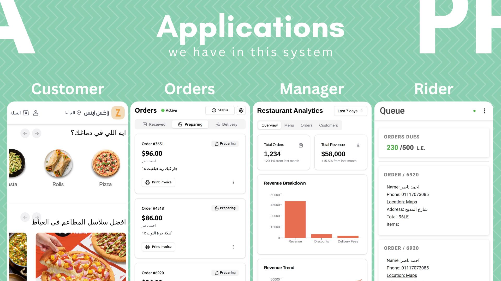

# Order Sync

## Table of Contents
1. [Demo Online Links](#demo-online-links)
2. [Introduction](#introduction)
3. [Diagrams](#diagrams)
4. [User Roles and Permissions](#user-roles-and-permissions)
5. [App Features](#app-features)
6. [Technical Requirements](#technical-requirements)
7. [Order Workflow](#order-workflow)
8. [Future Updates and Maintenance](#future-updates-and-maintenance)
9. [Frequently Asked Questions (FAQs)](#frequently-asked-questions-faqs)

## Demo Online Links
Store Website: https://ordersync.vercel.app 
Orders Website: https://ordersync-orders.vercel.app 
Rider Website: https://ordersync-rider.vercel.app 
Partner Website:  

## Introduction

### Brief Overview of the App
Order Sync is a cutting-edge ordering system meticulously crafted for restaurants. Seamlessly integrating into applications, it boasts a robust back-end powered by Google Firebase, ensuring secure authentication. The Order Sync app delivers a streamlined and efficient online ordering experience.

## Diagrams

## User Roles and Permissions

### Business Manager App
- Login/Signup
- Manage orders (view, update, and close)
- Read closed orders
- Add and manage staff members
- Manage restaurant menu
- Settings
  - Site control

### Staff App
- Login/Signup
- Manage assigned orders (view and close)

### Customer Shop App
- Login/Signup
- Cart management
- Settings
  - Update user information (name, phone number)
  - Update address with interactive map or manual text input
- Browse restaurants and menus
- Browse cuisine categories and top restaurant chains
- View restaurants with online food delivery
- Place orders
- Collect loyalty points for each restaurant

## App Features

### Business Manager App
- Orders management
- Menu management
- Staff members management
- Reports

### Staff App
- Read orders details by the role "Order Captain" or "Delivery Captain"
- Submit order to next status
- Reports

### Customer Shop App
- Read different restaurants based on city with their menus
- User cart
- Order placement with comment
- Offer attractive discounts
- Contact info with select location on map and find my location

## Technical Requirements

| App              | Devices        | Provided On  |
|------------------|----------------|--------------|
| Business Manager | Desktop/Laptop | Website      |
| Staff App        | Smartphone/Tablet | App/Website |
| Customer Shop    | Any            | App/Website  |

## Order Workflow

**Order Journey in Four Steps**

1. Customer places an order (Customer Shop).
2. Business Manager reviews and accepts the order.
3. Order Captain or Delivery Captain prepares the order.
4. Delivery person delivers the order to the customer.

## Future Updates and Maintenance

**Upcoming Updates**
- Design improvements
- Enhanced reporting features

## Frequently Asked Questions (FAQs)

### Who would use the Business Manager App?
Restaurant owners who need to manage their received orders.

### Who would use the Staff App?
Individuals looking to work as Order Captains or Delivery Captains in this business.

### Who would use the Customer Shop App?
Customers looking to browse menus, place orders, and manage their accounts.

### Why use Order Sync as a business owner?

1. **Increased Customer Base Network Effect:**
   - The Customer Shop app features multiple restaurants in the same city, increasing visibility and potential customer base.

3. **Comprehensive Reporting:**
   - Access detailed reports on sales, order trends, and customer preferences for informed decision-making.

## Project Versions

 - 0.1.0 Demo

## License

This project is licensed under the [Apache-2.0 license](LICENSE).
